# AutoDub

**An experimental, local, human-in-the-loop pipeline for turning Japanese anime episodes into English dubs.**

> [!NOTE]
> **Status: personal research project — experimental, not a finished product.**
> AutoDub is a learning and engineering exercise in orchestrating many local AI models into one
> reviewable workflow. Dub quality is rough and uneven, several features are marked experimental
> in the app itself, setup is involved (multiple Python environments, large model downloads, an
> NVIDIA GPU for the quality path), and it has only been used on one Windows workstation. It is
> shared as a portfolio piece to show the design, not as software ready for general use. Expect
> breaking changes and no support.

AutoDub takes a video file and produces an English-dubbed copy: it separates dialogue from music
and effects, transcribes and translates the Japanese, works out who is speaking, clones each
character's voice into English, fits every line into the original timing, and remixes the result
over the untouched music and video. A web studio puts a person in charge of every decision that
matters — who each speaker is, what each line says, which voice each character gets — before any
audio is rendered.

Everything runs on your own machine. The runtime makes no network calls, sends no telemetry, and
downloads nothing; models are fetched once, explicitly, by a separate script.


<sub>Screenshots use a synthetic two-voice demo scene built by the test tooling, so source and
English lines match; with a Japanese source the left column shows the transcript.</sub>

---

## Highlights

- **End-to-end dubbing pipeline** — separation (Demucs) → speech recognition (Whisper large-v3) →
  forced alignment (WhisperX) → speaker diarization (pyannote) → translation (Marian) → optional
  slot-aware adaptation (Qwen3-14B) → voice-cloned synthesis (Qwen3-TTS) → timing fit → mix → mux.
- **Human review where it counts** — nothing is dubbed until a reviewer has checked speakers,
  translations and casting. The UI shows the evidence behind every automatic suggestion
  (similarity scores, video frames, audio clips) and never relabels a speaker on its own.
- **Series-aware voice bank** — characters are identified by voice embeddings across every episode
  of a show, so a character named once keeps the same voice in every episode and season.
  Matching is three-zone (auto-apply / ask / new), calibrated on real data, and every decision is
  logged to an append-only audit trail.
- **Slot-aware dialogue adaptation** — lines that are too long or short for their time slot are
  rewritten by a local LLM under a validator that rejects any change to names, numbers, negation,
  or question form, the way an ADR writer adapts a dub script.
- **Safety by construction** — GPU work requires an explicit, single-use arm and an exclusive
  lease; the episode queue has a thermal guard that fails closed; non-loopback binds are refused;
  the HTTP API never exposes host paths, source filenames, or tracebacks.
- **Resumable and observable** — every job is an opaque ID with atomic state on disk; stages can be
  cancelled and resumed; errors always leave a log trail; every render is stamped with the code
  revision that produced it.
- **Experiment harness** — A/B comparisons that change one component at a time (TTS model, mix
  balance, timing policy, separator, aligner), judged blind in a built-in review page.


## How it works

```mermaid
flowchart LR
    V[Source video] --> X[Extract audio]
    X --> S[Separate<br/>dialogue / bed]
    S --> T[Transcribe<br/>Whisper]
    T --> A[Align<br/>WhisperX]
    A --> D[Diarize<br/>pyannote]
    D --> TR[Translate<br/>Marian]
    TR --> R{{Human review<br/>speakers · lines · cast}}
    R --> AD[Adapt lines<br/>to slots · Qwen3-14B]
    AD --> TTS[Voice clone<br/>Qwen3-TTS]
    TTS --> F[Fit timing]
    F --> M[Mix over bed]
    M --> MX[Mux with<br/>original video]
    MX --> O[English dub]
```



The orchestrator, HTTP server and web UI are pure Python standard library. Each model family runs
in its own worker process and virtual environment, exchanging JSON over stdio, so conflicting
dependency stacks (different PyTorch/CUDA builds per model) never have to share an interpreter.
See [docs/ARCHITECTURE.md](docs/ARCHITECTURE.md) for the full design.

Two quality profiles are built in:

| Profile | Hardware | Stack |
|---|---|---|
| `quality-gpu-v1` (default) | NVIDIA GPU | Demucs, Whisper large-v3 fp16, WhisperX, pyannote, Qwen3-TTS voice cloning |
| `prototype-cpu-v1` | CPU only | Whisper int8, acoustic clustering, source-bed ducking, system or GPT-SoVITS voices |

## Quick start

Requirements: Python 3.11+ and FFmpeg. The quality profile also needs an NVIDIA GPU with CUDA.

```bash
git clone <this repository> autodub && cd autodub
python -m venv .venv && .venv/Scripts/activate     # source .venv/bin/activate on Linux/macOS
pip install -e ".[download]"

# CPU worker environment (see docs/SETUP.md for the GPU environments)
python -m venv envs/media
envs/media/Scripts/pip install -r requirements/media.txt
set AUTODUB_PYTHON_MEDIA=envs\media\Scripts\python.exe   # export ... on Linux/macOS

python scripts/download_models.py --accept-online-download core
python -m autodub doctor          # "core": true means the CPU pipeline is ready
python -m autodub serve           # http://127.0.0.1:8030
```

Full installation, including the GPU environments and optional components, is in
[docs/SETUP.md](docs/SETUP.md). Every setting is an environment variable; see
[`.env.example`](.env.example).

### Command line

```bash
python -m autodub import --in episode01.mkv          # creates an opaque job
python -m autodub analyze --job <id> --arm-gpu        # separation, ASR, diarization, translation
python -m autodub render  --job <id> --arm-gpu        # synthesis, fit, mix, mux
python -m autodub status  --job <id>
```

## Testing

```bash
python -m unittest discover -s tests -t .      # 241 tests; model/ffmpeg-dependent ones skip if absent
python scripts/smoke_test.py                   # full pipeline on a synthetic clip with real models
python scripts/verify_models.py                # offline integrity check of downloaded weights
```

The suite runs in an isolated temporary data directory and never touches real jobs. CI runs it on
Linux and Windows for every push. See [docs/TESTING.md](docs/TESTING.md).

## Project layout

```
src/autodub/
  cli.py, server.py          command line and loopback HTTP API
  pipeline.py, workflow.py   stage orchestration, resumable job flow
  adapters.py, media.py      worker processes and ffmpeg operations
  voice_bank.py, series.py   cross-episode character identity
  characters.py, casting.py  review and casting operations
  adaptation*.py             slot-aware dialogue rewriting
  gpu_session.py, thermal.py GPU admission, leasing, thermal guard
  experiments/               experiment registry and executors
  workers/                   model workers (run in their own environments)
  web/static/                studio UI (no build step, no external assets)
scripts/                     model download/verification, smoke test, calibration
tests/                       unit, contract and end-to-end tests
docs/                        architecture, setup, GPU coordination, testing
```

## Known limitations

- **Quality is uneven.** Voice cloning, speaker separation and timing fit work well on some scenes
  and poorly on others; a human pass is required, and even then the result is not broadcast grade.
- **Japanese → English only**, tuned on anime with clear dialogue; songs, crowd scenes and heavy
  overlap are handled by conservative heuristics that can be wrong.
- **Heavy setup.** Five worker environments are possible; the CPU path needs one, the GPU path two.
  Models total tens of gigabytes.
- **Tested on one machine** (Windows 11, NVIDIA GPU). Linux is covered by the unit tests only.
- **Experimental features** (song detection, dialogue adaptation, TTS model comparisons) are
  labelled as such in the UI.

## Responsible use

AutoDub is a personal research and production tool. Dub only media you have the right to modify,
and clone only voices you have permission to use. Model weights are subject to their own licenses —
see [THIRD-PARTY-NOTICES.md](THIRD-PARTY-NOTICES.md).

## License

MIT — see [LICENSE](LICENSE). Third-party components are listed with their licenses in
[THIRD-PARTY-NOTICES.md](THIRD-PARTY-NOTICES.md).
