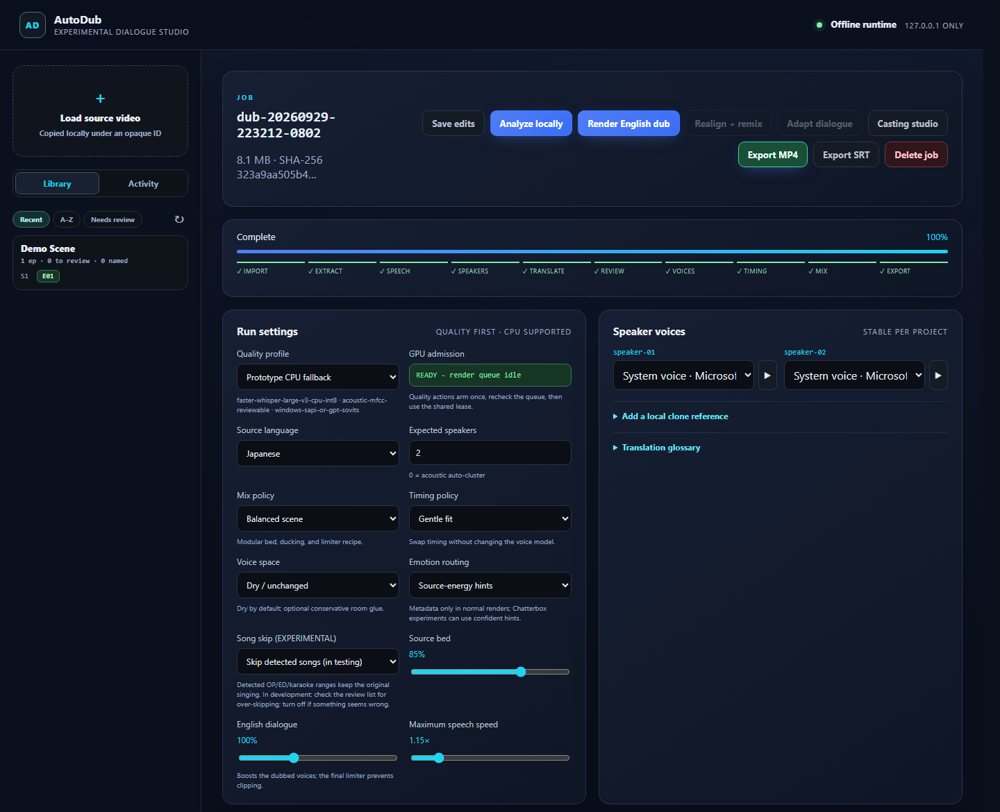
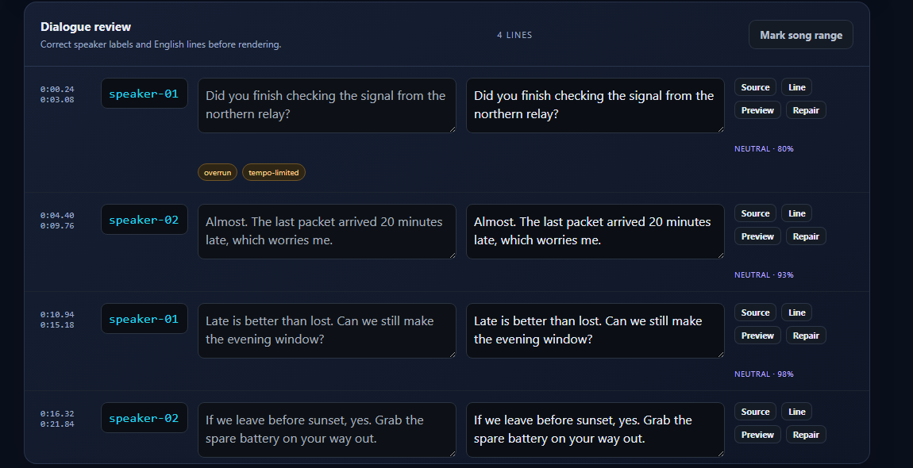

# AutoDub

[](https://github.com/chronoite/autodub/actions/workflows/ci.yml)

[](LICENSE)


**An experimental, local, human-in-the-loop pipeline for turning Japanese anime episodes into English dubs.**

> [!NOTE]
> **Status: personal research project — experimental, not a finished product.**
> AutoDub is a learning and engineering exercise in orchestrating many local AI models into one
> reviewable workflow. It is shared as a portfolio piece to show the design, not as software ready
> for general use: dub quality is rough and uneven, and there is no support. See
> [Known limitations](#known-limitations). Issues and pull requests are not being accepted.

AutoDub takes a video file and produces an English-dubbed copy: it separates dialogue from music
and effects, transcribes and translates the Japanese, works out who is speaking, clones each
character's voice into English, fits every line into the original timing, and remixes the result
over the untouched music and video. After analysis the pipeline stops so a person can review who
each speaker is, what each line says, and which voice each character gets.

Everything runs on your own machine. The runtime makes no internet requests and sends no
telemetry; its only network traffic is to local services you configure (loopback by default).
Models are downloaded once, explicitly, by a separate script.



<sub>Screenshots use a synthetic two-voice English demo scene (no copyrighted media), so the source
and English columns match; with a Japanese source the left column shows the transcript. No sample
dub is included for the same copyright reason.</sub>

---

## Highlights

- **End-to-end dubbing pipeline** — separation (Demucs) → speech recognition (Whisper large-v3) →
  forced alignment (WhisperX) → speaker diarization (pyannote) → translation (Marian) → optional
  slot-aware adaptation (Qwen3-14B) → voice-cloned synthesis (Qwen3-TTS) → timing fit → mix → mux.
- **Human review where it counts** — the pipeline stops for review after analysis. The UI shows
  the evidence behind every suggestion (similarity scores, video frames, audio clips); automatic
  matchers never merge speakers, and only near-certain voice-bank matches (cosine ≥ 0.95) are
  applied without asking, each one logged.
- **Series-aware voice bank** — characters are identified by voice embeddings across every episode
  of a show, so a character named once keeps the same voice in every episode and season.
  Matching is three-zone (auto-apply / ask / new), calibrated on real episodes, with an
  append-only decision log.
- **Slot-aware dialogue adaptation** — lines too long or short for their time slot are rewritten by
  a local LLM under a heuristic validator that rejects rewrites that drop a name or number, flip
  negation, or turn a question into a statement.
- **Safety guards** — GPU work needs explicit authorization (a single-use, five-minute arm in the
  UI; `--arm-gpu` on the CLI) and an exclusive lease; the episode queue has a thermal guard that
  fails closed; non-loopback binds are refused; the HTTP API never returns host paths, source
  filenames, or tracebacks.
- **Resumable and observable** — every job is an opaque ID with atomic state on disk; stages can be
  cancelled and resumed; errors always leave a log trail; every render is stamped with the code
  revision that produced it.
- **Experiment harness** — A/B comparisons that change one component at a time (TTS model, mix
  balance, timing policy, separator, aligner), judged blind in a built-in review page.



## How it works

```mermaid
flowchart LR
    V[Source video] --> X[Extract audio]
    X --> S[Separate<br/>dialogue / bed]
    S --> T[Transcribe<br/>Whisper]
    T --> A[Align<br/>WhisperX]
    A --> D[Diarize<br/>pyannote]
    D --> TR[Translate<br/>Marian]
    TR --> R{{Human review<br/>speakers · lines · cast}}
    R --> AD[Adapt lines to slots<br/>Qwen3-14B · optional]
    AD --> TTS[Voice clone<br/>Qwen3-TTS]
    TTS --> F[Fit timing]
    F --> M[Mix over bed]
    M --> MX[Mux with<br/>original video]
    MX --> O[English dub]
```



The orchestrator, HTTP server and web UI use only the Python standard library. Each model family
runs in its own worker process and virtual environment, exchanging JSON over stdio, so conflicting
dependency stacks (different PyTorch/CUDA builds per model) never have to share an interpreter.

Two quality profiles are built in:

| Profile | Hardware | Stack |
|---|---|---|
| `quality-gpu-v1` (default) | NVIDIA GPU | Demucs, Whisper large-v3 fp16, WhisperX, pyannote, Qwen3-TTS voice cloning |
| `prototype-cpu-v1` | CPU only | Whisper int8, acoustic clustering, source-bed ducking, Windows SAPI voices or a local GPT-SoVITS server |

### Engineering notes

- **Clean voice references.** Clone references are chosen only from windows that pass an overlap
  and confidence gate — on the *minimum* confidence of their segments, because averages hid bad
  ones.
- **Runaway-TTS guard.** A contaminated reference can make an autoregressive TTS model babble for
  minutes into a one-second slot; raw synthesis length is checked against the slot, retried, then
  switched to a spare clean reference.
- **Rendered-overlap QC.** Overlap is measured on the audio actually placed, not on source windows,
  which had reported zero overlaps on renders with audible double voices.
- **Complete-linkage clustering.** Cross-episode speaker groups join only when a voice matches
  *every* member, after single-link joining chained different people into one group.

## Documentation

- [Architecture](docs/ARCHITECTURE.md) — process model, job lifecycle, identity, adaptation, safety
- [Setup](docs/SETUP.md) — worker environments, models, configuration reference
- [GPU coordination](docs/GPU-COORDINATION.md) — arm, preflight, lease, broker protocol, thermal guard
- [Testing](docs/TESTING.md) — unit suite, smoke test, model verification, CI
- [Experiments](src/autodub/experiments/README.md) — the A/B experiment registry and executors
- [Changelog](CHANGELOG.md)

## Quick start

Requirements: Python 3.11+ and FFmpeg on `PATH`. The quality profile also needs an NVIDIA GPU with
CUDA; the CPU profile's built-in voices are Windows-only.

Windows (PowerShell):

```powershell
git clone https://github.com/chronoite/autodub.git; cd autodub
python -m venv .venv; .venv\Scripts\Activate.ps1
pip install -e ".[download]"

# CPU worker environment (docs/SETUP.md covers the GPU environments)
python -m venv envs\media
envs\media\Scripts\pip install -r requirements\media.txt
$env:AUTODUB_PYTHON_MEDIA = "$PWD\envs\media\Scripts\python.exe"

python scripts\download_models.py --accept-online-download core
python -m autodub doctor      # "core": true means the CPU pipeline is ready
python -m autodub serve       # http://127.0.0.1:8030
```

Linux/macOS:

```bash
git clone https://github.com/chronoite/autodub.git && cd autodub
python -m venv .venv && source .venv/bin/activate
pip install -e ".[download]"
python -m venv envs/media && envs/media/bin/pip install -r requirements/media.txt
export AUTODUB_PYTHON_MEDIA="$PWD/envs/media/bin/python"
python scripts/download_models.py --accept-online-download core
python -m autodub doctor && python -m autodub serve
```

Every setting is an environment variable; see [`.env.example`](.env.example).

### Command line

```bash
python -m autodub import --in episode01.mkv      # creates an opaque job
python -m autodub analyze --job <id> --arm-gpu    # separation, ASR, diarization, translation
python -m autodub render  --job <id> --arm-gpu    # synthesis, fit, mix, mux
python -m autodub status  --job <id>
python -m autodub cancel  --job <id>
```

## Testing

```bash
pip install -e ".[test]"
python -m unittest discover -s tests -t .   # model/ffmpeg-dependent tests skip when absent
python scripts/smoke_test.py                # CPU pipeline end to end with real models
python scripts/verify_models.py             # offline integrity check of downloaded weights
```

The suite runs in an isolated temporary data directory and never touches real jobs. CI runs it on
Linux and Windows for every push to `main`. The smoke test's synthetic clip uses Windows speech
voices; elsewhere pass `--source <clip>`.

## Project layout

```
src/autodub/
  cli.py, server.py          command line and loopback HTTP API
  pipeline.py, workflow.py   stage orchestration, resumable job flow
  adapters.py, media.py      worker processes and ffmpeg operations
  speaker_evidence.py        speaker centroids, eligibility, duplicate hints
  voice_bank.py, series.py   cross-episode character identity
  characters.py, casting.py  review and casting operations
  adaptation*.py             slot-aware dialogue rewriting
  song_detect.py             opening/ending theme detection (experimental)
  episode_queue.py           thermal-aware batch rendering
  gpu_session.py, thermal.py GPU admission, leasing, temperature reading
  experiments/               experiment registry and executors
  workers/                   model workers (run in their own environments)
  web/static/                studio UI (no build step, no external assets)
scripts/                     model download/verification, smoke test, calibration
tests/                       unit, contract and end-to-end tests
docs/                        architecture, setup, GPU coordination, testing
```

## Known limitations

- **Quality is uneven.** Voice cloning, speaker separation and timing fit work well on some scenes
  and poorly on others; a human pass is required, and even then the result is not broadcast grade.
- **Japanese → English only**, tuned on anime with clear dialogue; songs, crowd scenes and heavy
  overlap are handled by conservative heuristics that can be wrong.
- **Heavy setup.** The CPU path needs one worker environment and the GPU path three (media,
  analysis, TTS); models total tens of gigabytes.
- **Tested on one machine** (Windows 11, NVIDIA GPU). Linux is covered by the unit tests only, and
  the CPU profile's built-in voices are Windows-only.
- **Large modules.** `pipeline.py` and `server.py` grew with the project and are due to be split;
  their behaviour is pinned by tests first.
- **Experimental features.** Song detection is labelled experimental in the UI; dialogue
  adaptation and the TTS comparisons are the least tested parts.

## Responsible use

AutoDub is a personal research project. Dub only media you have the right to modify, and clone
only voices you have permission to use. Model weights are subject to their own licenses — see
[THIRD-PARTY-NOTICES.md](THIRD-PARTY-NOTICES.md).

## License

MIT — see [LICENSE](LICENSE). Third-party components are listed with their licenses in
[THIRD-PARTY-NOTICES.md](THIRD-PARTY-NOTICES.md).
