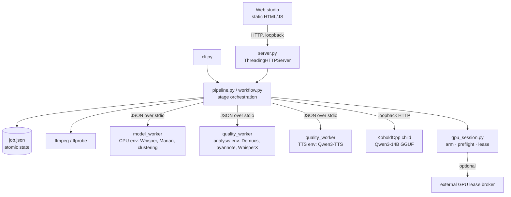

# Architecture

## Goals and constraints

| Goal | Consequence in the design |
|---|---|
| Fully local and private | No runtime network access: workers run with Hugging Face offline flags, downloaders are stubbed out to raise, models come from pinned local paths. The server binds loopback only. |
| Human judgment on anything subjective | The pipeline stops at a review state after analysis. Automatic matchers only *propose*; recorded reviewer answers are the only thing that changes speaker identity. |
| Heavy, conflicting ML dependencies | Each model family runs in its own interpreter and virtual environment as a short-lived worker process. The orchestrator itself has zero third-party dependencies. |
| Long jobs on consumer hardware | Every job is resumable, cancellable and persisted atomically; GPU work is explicitly armed, exclusively leased, and guarded by temperature. |
| Evolving model choices | Models sit behind worker commands and quality profiles; experiments compare one component at a time before anything becomes a default. |

## Process model



- **server.py** — a `ThreadingHTTPServer` serving the static UI and a JSON API. It refuses
  non-loopback binds, sends a strict Content-Security-Policy (`default-src 'self'`, no inline
  scripts, no external origins), and runs long stages on background threads so requests stay fast.
- **pipeline.py / workflow.py** — stage functions for analysis and render in two variants (the
  CPU prototype path and the GPU quality path), plus targeted operations: single-line preview and
  repair, remix from cached lines, source realignment, adaptation.
- **Workers** (`src/autodub/workers/`) — plain scripts executed with the interpreter configured for
  their model family. The parent passes a JSON payload on stdin and reads one JSON result from
  stdout; library chatter goes to stderr and is preserved in the job log. Workers force offline
  mode before importing any ML library.
- **KoboldCpp** — for dialogue adaptation, AutoDub starts its own loopback-only KoboldCpp child on a
  dedicated port, waits for readiness, and stops the entire process tree afterwards (KoboldCpp is a
  launcher that spawns a worker child; stopping only the launcher would leave the model in VRAM).

## Job lifecycle

```
import ─► analyze ─► review ─► (adapt) ─► render ─► complete
             │          ▲  │                 │
             └─ failed ─┘  └── preview / repair / remix / realign
```

Each job is a directory `$AUTODUB_HOME/work/jobs/<opaque-id>/` holding `job.json`, the copied
source, and stage artifacts (`artifacts/lines`, `aligned`, `separation`, `voice-references`, …).

- **Opaque IDs.** Jobs are named `dub-<timestamp>-<random>`. The original filename is kept only as
  a display hint and is never logged or returned by the API; public job views strip host paths,
  tracebacks, and raw voice embeddings.
- **Atomic state.** `save_job` writes to a temp file, fsyncs, and `os.replace`s it into place, with a
  short retry because Windows refuses a rename while any reader holds the file open. A per-job lock
  serializes every read-modify-write path (UI edits, casting operations, demo rendering).
- **Resumability.** Rendered lines are cached under a signature of their text, voice and settings;
  changing one line re-synthesizes one line. Cancellation is a flag checked between stages.
- **Provenance.** Every analyze and render event is stamped with the git revision of the running
  code, so "is the server running the code I committed?" is checkable from the job history.

## Quality pipeline (GPU profile)

| Stage | Component | Notes |
|---|---|---|
| Separate | Demucs htdemucs_ft | Dialogue stem for analysis/cloning; music+effects bed for the mix. |
| Transcribe | faster-whisper large-v3 | Runs on the dialogue stem; word timestamps. |
| Align | WhisperX + wav2vec2-ja | Refines Japanese speech windows. |
| Diarize | pyannote community-1 | Exclusive speaker assignment; optional speaker-count hints. |
| Evidence | speaker_evidence.py | Voiced-duration eligibility, centroids, duplicate-speaker hints (advisory only). |
| Translate | Marian opus-mt-ja-en | Embedded English subtitles, when present, are harvested as the reviewer's reference. |
| Songs | song_detect.py | Chapter markers and subtitle styles flag opening/ending themes; songs keep the original singing. Experimental and fail-open. |
| Review | web studio | Speakers, lines, casting, voice bank. |
| Adapt | adaptation*.py + Qwen3-14B | Optional; see below. |
| Synthesize | Qwen3-TTS 1.7B | Per-speaker clone references picked from clean, confident solo windows; runaway guard. |
| Fit | media.align_line | Silence trim, bounded tempo, "preserve-capped" mode: a line may run past its slot into silence but never across the next line. |
| Mix | media.build_mix | Dialogue over the separated bed with sidechain ducking; songs and non-verbal sounds restored at unity gain; batched pre-summing keeps ffmpeg command lines under Windows' 32k limit. |
| Mux | ffmpeg | Original video stream copied untouched. |

### Robustness features worth noting

- **Clean voice references.** The reference picker scores candidate windows only inside a pool that
  passes an overlap and confidence gate, gating on the *minimum* confidence of a window's segments
  rather than the average (averages hid bad segments).
- **Runaway-TTS guard.** A contaminated reference can make an autoregressive TTS babble for minutes
  in a one-second slot. Raw synthesis length is checked against the slot; a runaway is retried, then
  switched to a spare clean reference, and later lines for that speaker start on the fallback.
- **Non-verbal passthrough.** Screams, laughs and gasps that the transcript does not cover would
  vanish when the vocal stem is replaced; voiced windows outside all transcript segments are sliced
  from the original vocals and mixed back.
- **Rendered-overlap QC.** Overlaps are measured on the audio actually placed, not on source
  windows — source-window QC once reported zero overlaps on renders with audible double voices.

## Identity across episodes

- **Series voice bank** (`voice_bank.py`) — per show, each character has an identity centroid in a
  stamped embedding space plus a pinned TTS reference (clip + transcript). If the configured
  embedder changes, stored centroids are quarantined instead of silently compared across spaces.
- **Three-zone matching** — cosine ≥ 0.95 auto-assigns (and logs the decision), 0.90–0.95 asks the
  reviewer, below 0.90 proposes a new character. Thresholds were calibrated on real episodes:
  different speakers scored up to 0.914 against each other, the same character 0.94–0.99.
- **Cross-episode clustering** (`series.py`) — greedy complete-linkage at the match threshold, so a
  speaker joins a group only if it matches *every* member (single-link chained different people into
  one group). Each group carries a red/amber/green confidence light from its worst pairwise link and
  thinnest solo audio. Reviewer "not the same person" and "same person" answers become cannot-link and
  must-link constraints that later clustering passes respect.
- **Decision log** — every auto-match and every reviewer answer is appended to
  `decisions.jsonl`; nothing is rewritten.

## Dialogue adaptation

`adaptation.py` is pure (budget math, classification, validator); `adaptation_runner.py` does the
I/O. For each line the budget is the time until the next rendered line or song, and the estimated
spoken length comes from a measured characters-per-second rate (`scripts/measure_cps.py`). Lines
that are too long are shortened, and much-too-short lines are expanded to ~80% of their slot, by a
local LLM in batched, meaning-locked prompts. The validator rejects candidates that drop a name or
number, flip polarity, or change a question into a statement. Rewrite engines are pluggable: any
engine that writes a candidate file participates, and the best valid candidate per line wins.

## GPU and thermal safety

- **Arm → preflight → lease.** GPU actions need a single-use arm from the UI (expires in five
  minutes), a fresh preflight, and an exclusive lease released in `finally`. The default lease is an
  in-process lock; an optional HTTP broker lets several applications share one GPU — see
  [GPU-COORDINATION.md](GPU-COORDINATION.md).
- **Thermal guard.** The episode queue reads GPU temperatures before every GPU episode (nvidia-smi,
  or a custom sensor command that can report memory-junction temperature) and aborts at 95 °C.
  An unreadable sensor also aborts: the guard fails closed. Episodes are separated by an
  interruptible cooldown.

## Logging and privacy

Errors and tracebacks are always written; per-line detail is behind a verbose toggle. Logs rotate by
size and keep only the newest jobs. Media names and host paths are never logged; dialogue text
appears only in job-local logs beside the `job.json` that already contains it.

## Experiments

The experiment registry (`src/autodub/experiments/registry.json`) defines comparisons that each
change one component while holding the scene and criteria fixed. Runs are created from the UI or
CLI, executed locally, and judged in the built-in Experiment review page with blind, shuffled
candidate labels. No winner is promoted from automated metrics alone.
